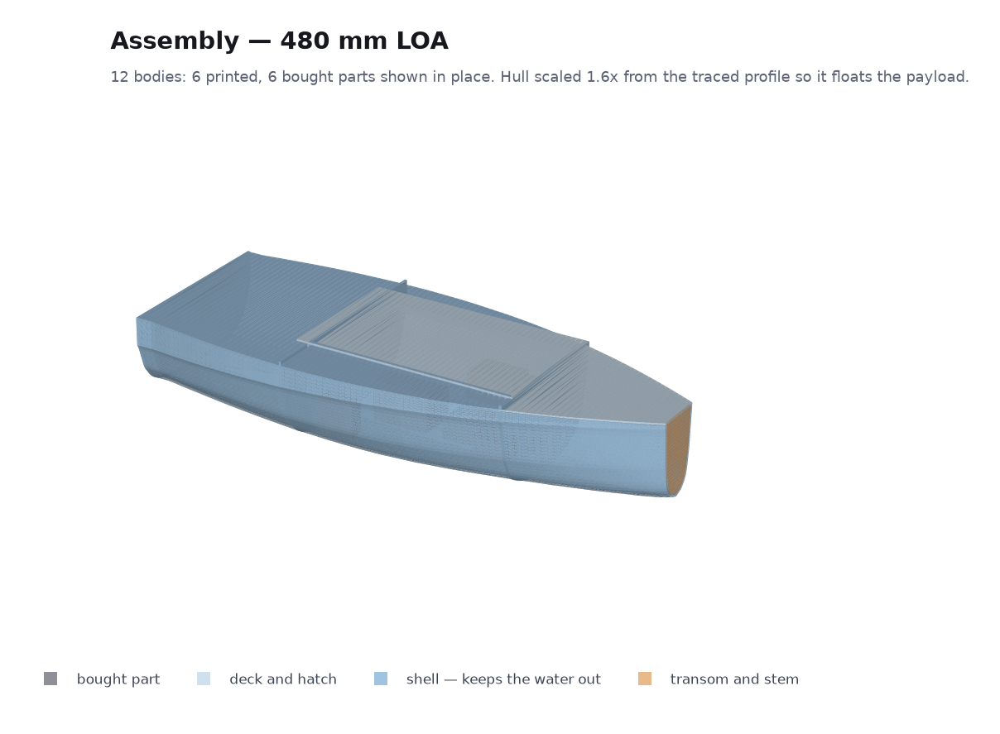
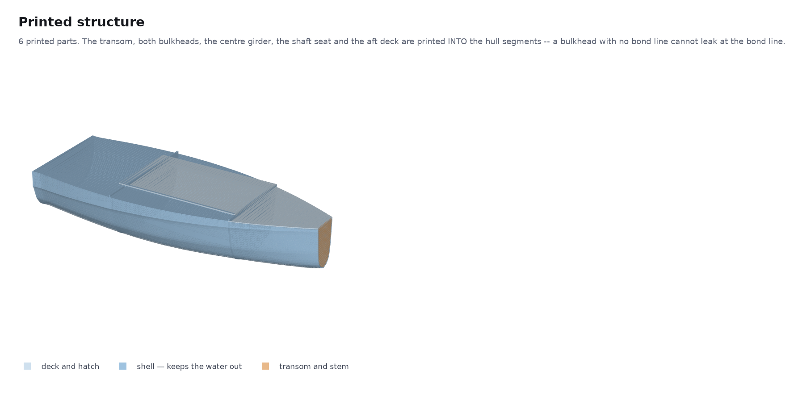
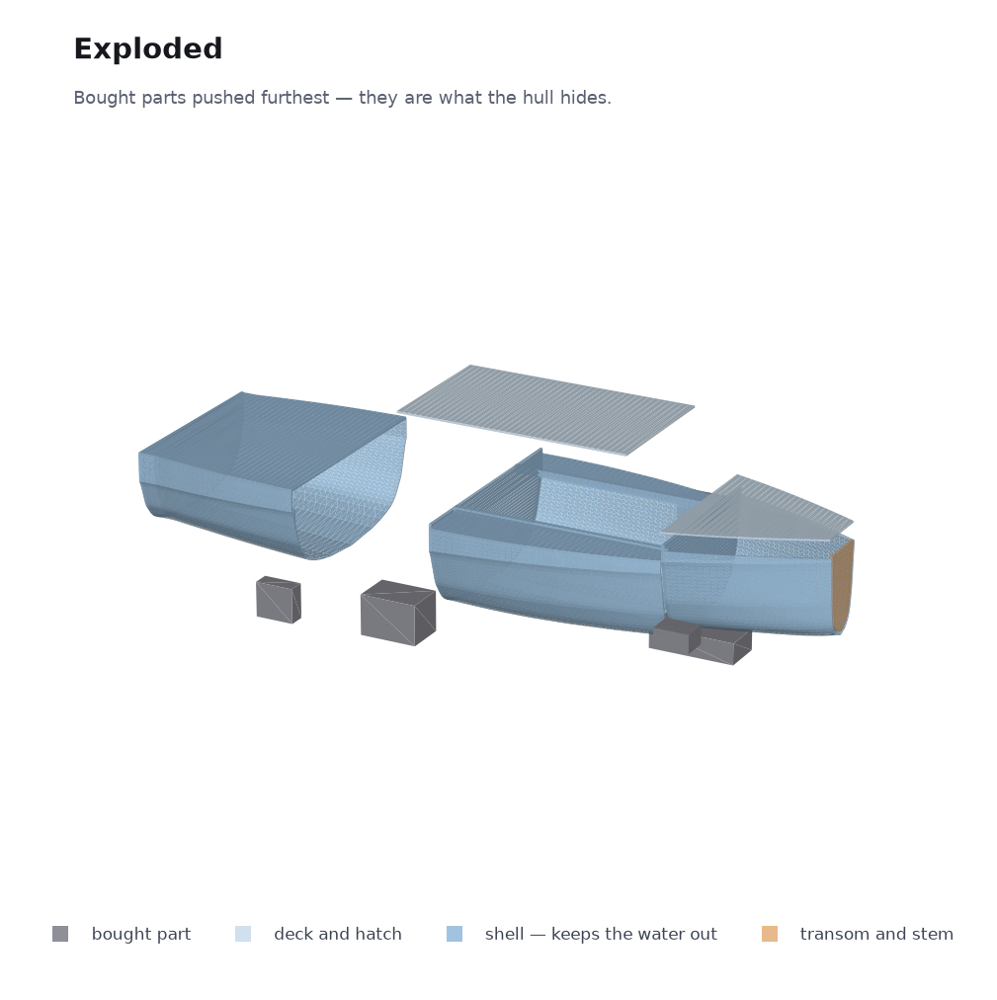
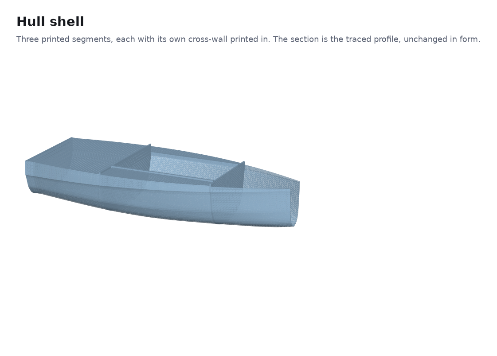
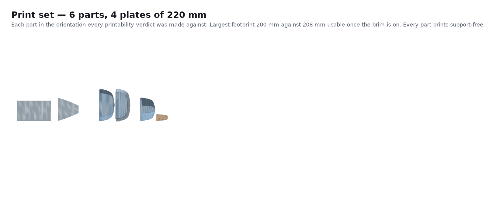

# boaty

A 3D-printed RC displacement boat, 480 mm LOA, developed from one screenshot of a
hull-design tool using [atompipe](https://github.com/neuman/atompipe).

**Start here:** [`docs/readiness.md`](docs/readiness.md) — what is proven, what is
assumed, and what only a real boat in real water can settle.



<sub>19 bodies: 13 printed, 6 bought parts shown where they sit. Renders are
generated from the same STLs the gates measure — `python tools/render.py`.</sub>

| | |
|---|---|
| [`docs/BUY.md`](docs/BUY.md) | what to order, with prices and ASINs |
| [`docs/PRINT.md`](docs/PRINT.md) | what to print (**6 parts, 4 beds**), in what orientation, and what to drill |
| [`docs/BUILD.md`](docs/BUILD.md) | the assembly order, arranged so mistakes stay cheap |
| [`docs/decisions.md`](docs/decisions.md) | every design decision and what LOST |
| [`FRICTION.md`](FRICTION.md) | an unflattering log of using the tool |

## The finding that shaped everything

The hull in the screenshot is 300 mm long and **displaces 73 grams at the waterline
the design tool drew**. The parts alone weigh 591 g. That waterline was a slider
position, not a loading condition.

Displacement scales as the cube of length while a motor, an ESC, a servo, a receiver
and a battery do not scale at all, so the hull is scaled 1.6x to 480 mm and the FORM
is untouched — every offset is the traced one times 1.6. At that size it floats at
29.6 mm draft with 27.3 mm of freeboard after trim, and 70% of its moulded volume in
reserve.

## What it looks like

| | |
|---|---|
|  | **The 13 printed parts.** Bulkheads and the centre girder divide the bilge into 53 mm cells, which is what holds the free-surface correction to 4.2 mm of GM. |
|  | **Exploded.** The bought parts are pushed furthest because they are what the hull hides — and where the first version put the motor, the battery and the girder in the same space. |
|  | **The hull shell**, in three printed segments. The section is the traced profile, unchanged in form and scaled 1.6x. |
|  | **Eight plates, not one.** Two parts are 190 and 186 mm wide, so they share a 220 mm bed with nothing. |

## Six parts, two glued joints

The transom, both watertight bulkheads, the centre girder, the shaft seat and the aft
deck are printed INTO the hull segments rather than glued on. That is not tidiness: a
bulkhead with no bond line cannot leak at the bond line, and watertightness is the
top physical risk on the whole boat. It works because each segment prints standing on
a transverse face with its one solid cross-wall ON THE BED — put a cross-wall at the
far end of a segment instead and it becomes a 186 mm plate the print has to bridge.

Two merges were rejected and both are in the decision log: the stem cap, and the bow
deck. Both would have roofed an open cavity at the top of a print, and both being
separate is also what leaves the bow compartment open until its foam and interior
epoxy are in.

## Layout

```
brief/            the screenshot this all came from
inputs/           evidence, and what was read out of it
tools/            trace_hull_profile.py   screenshot -> hull offsets
                  emit_docs.py            model -> BUY/PRINT/BUILD
                  render.py               STLs -> renders/ (no GPU, no display)
renders/          generated. Regenerate with tools/render.py.
model/            hullform.py  the hull surface and its integrals
                  geometry.py  offsets -> meshes
                  boat.py      THE MODEL. Everything else is generated from it.
gates/            the seven checks no installed pack covers
selftest/         a known-bad input for each of those seven
build/            generated STLs (assembly frame) and build/print/ (bed frame)
docs/             generated: readiness, buy, print, build, decisions
site/             the same ledger as a page: atompipe site serve
```

## Running it

```sh
.venv/bin/atompipe check              # tier 0, under a second
.venv/bin/atompipe check --tier 1     # the full sweep, including meshes
.venv/bin/atompipe gate selftest      # prove every gate can still fail
.venv/bin/atompipe report             # the readiness report
.venv/bin/atompipe why hull_scale     # one parameter's whole history
.venv/bin/atompipe site serve         # the ledger as a page
.venv/bin/python tools/emit_docs.py   # regenerate the buy/print/build docs
```

**Generated files are outputs.** Do not hand-edit anything in `build/` or `docs/`;
change `model/boat.py` and re-run.
